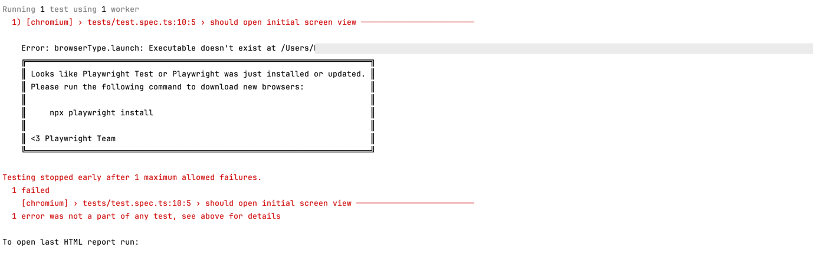

# Contributing

## Getting started

0. Install [Git](https://git-scm.com/downloads) and [Node.js](https://nodejs.org/en/download/)
1. Run in Terminal:
```
$ git clone https://github.com/epam/mriviewer.git && cd mriviewer
$ npm i
$ npm start
```

## IDE Configuration

https://stackoverflow.com/questions/41920324/adding-spaces-between-imports-and-braces-in-webstorm

## Submitting changes

We are following [GitHub's Collaborating with Issues and Pull Requests Guide](https://docs.github.com/en/github/collaborating-with-issues-and-pull-requests)

## Demo data customization

### To add custom models to Demo files
Edit `/src/demo/config/config.js`, for example:

```
export default {
  demoPelvisPrefix : 'http://your.site.com/folder1/folder2/folder3/dicom/modelName1/',
  demoPelvisUrls : [
    'file0001.dcm',
    'file0002.dcm',
    'file0003.dcm',
    'file0004.dcm',
    'file0005.dcm',
    'file0006.dcm',
    'file0007.dcm',
    'file0008.dcm',
    'file0009.dcm',
    'file0010.dcm',
    ...
    'file9871.dcm',
  ],
  demoLungsPrefix: 'http://your.site.com/folder1/folder2/folder3/dicom/modelName2/',
  demoLungsUrls: [
    'name001.dcm',
    'name002.dcm',
    'name003.dcm',
    'name004.dcm',
    'name005.dcm',
    ...
    'name406.dcm',
  ],
};
```
Demo data should have at least 32 dcm files (slices).

## E2E testing

### Overview
E2E testing is based on Playwright framework. Tests execution is configured to run in Chrome browser on Linux OS using docker.

### Run tests locally in docker
It needs to update screenshots or to check the result in same environment as in CI/CD pipeline.

1. Open terminal
2. Go to e2e-tests folder - `cd e2e-tests`
3. Prepare project for testing - `npm run docker:build`
4. Run test in docker 
   - Using "test" script to see the test result and log - `test=<test_file_name>:<test_row_number> npm run docker:test` (e.g. `test=test.spec.ts:10 npm run docker:test`)
   - Using "test:update" script to generate screenshots - `test=<test_file_name>:<test_row_number> npm run docker:test:update` (e.g. `test=test.spec.ts:10 npm run docker:test:update`)

#### Debug tests locally without docker
It needs to go through the tests step by step and visually check the test behaviour in the browser.

1. Open terminal
2. Go to e2e-tests folder - `cd e2e-tests`
3. Run test in debug mode locally without docker - `npm run test:debug -- <test_file_name>:<test_row_number>` (e.g. `npm run test:debug -- test1.spec.ts:10`)
   - If you see such error please follow the instructions provided in it and install playwrite locally
     

--- 
### Additional information

#### Detailed commands description
- `npm run docker:build` will create docker images for application and for testing. It will also run scripts to prepare environment (install dependencies for application and testing and build application).
- `[test=<test_file_name>:<test_row_number>] npm run docker:test` will run tests in docker container.
- `[test=<test_file_name>:<test_row_number>] npm run docker:test:updage` will run tests in docker container and generate screenshots if it does not exist or differs from existing one.