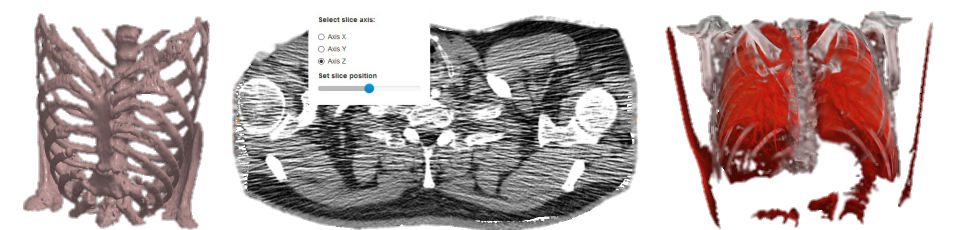

# Med3Web DICOM 2D/3D web viewer.

Med3Web is a high performance web tool for advanced visualization (both in 2D and 3D modes)
medical volumetric data, provided in popular file formats: DICOM, NIfTI, KTX<sup>™</sup>, HDR.

## Description

Med3Web can read local data from files/folders and from predefined web locations.

The [demonstration project](https://med3web.opensource.epam.com/) shows both (local data / remote data) usage types.



## Motivation

Med3Web can be used in a medical center with diagnostic equipment.

- ⚡️ MRI and CT scanning results can be viewed in any computer (inside the medical office and in the client home)
- 💡 Qualified medical personnel can provide diagnosis or conclusion based on provided visualization.
- :globe_with_meridians: App can be used as a web application as a part of large websites and services
- :mortar_board: Can be used by research institutes
due to NIfTI, HDR, etc. file standards support
- :hospital: Medical centers can create their clients database, based on this viewer.


## Installation

It works as a standalone HTML5 web application. The latest version can be used with
WebGL-enabled desktop browsers (Chrome, Firefox, Opera) and allows limited usage
with mobile browsers (Android Chrome). Version for Safari (macOS, iOS) is planned for future.

```
npm install
npm run start
```

## References

DICOM file format description can be found [here](http://dicom.nema.org/standard.html) and [here](https://www.leadtools.com/sdk/medical/dicom-spec).
KTX<sup>™</sup> file format details are listed in [KTX](https://www.khronos.org/registry/KTX/specs/1.0/ktxspec_v1.html).
Popular DICOM loader framework: [GDCM](https://sourceforge.net/projects/gdcm/).
Some JavaScript libraries to work with DICOM file format:
1. [dicomParser](https://github.com/chafey/dicomParser)
2. [Daikon](https://github.com/rii-mango/Daikon)
3. [Xtk](https://github.com/xtk/X#readme).

## 3D volumetric rendering idea in a few words

Three.js is used as some gateway to WebGL renderer. The current Three.js version does not support 3D textures,
so we use tricky way to build 2D texture from initial 3D texture by linking 2D slices all together
as a large tile map. This idea (with source codes) can be seen in project [WebGL Volume Rendering](https://github.com/lebarba/WebGLVolumeRendering).

# Publications 
Links to publications that contain **med3web** references
* [Belyaev, S., Smirnov, P., Smirnova, N., Shubnikov, V. Fast adaptive undersampling for volume rendering](http://dx.doi.org/10.24132/JWSCG.2019.27.1.1)
* [Belyaev, S.Y., Smirnova, N.D., Smirnov, P.O., Savchuk, D.A. Fast selective antialiasing for direct volume rendering](http://dx.doi.org/10.24132/JWSCG.2019.27.1.1)
* [Savchuk, D.A., Belyaev, S.Y. Two-pass real-Time direct isosurface rendering algorithm optimization for HTC Vive and low performance devices](http://dx.doi.org/10.1117/12.2292183)
* [Belyaev, S., Shubnikov, V., Motornyi, N. Adaptive screen sampling algorithm acceleration for volume rendering](https://www.scopus.com/record/display.uri?eid=2-s2.0-85063124756&origin=inward&txGid=79efa190ff7df9d2821ef08f7ac01e72)
* [Belyaev, S., Smirnov, P., Shubnikov, V., Smirnova, N. Adaptive algorithm for accelerating direct isosurface rendering on GPU](https://www.scopus.com/record/display.uri?eid=2-s2.0-85059228722&doi=10.11989%2fJEST.1674-862X.71013102&origin=inward&txGid=a917c3aa38d38f5b6e1b5add9aa3bb29)

## Demo app
[Here](https://med3web.opensource.epam.com/) you can find a demo app.

## Contribution
See [Contributing Guide](./contributing.md).

## License
[Apache 2.0](./LICENCE.MD)

Copyright (c) 2015–2021 [EPAM Systems, Inc.](https://www.epam.com/)
