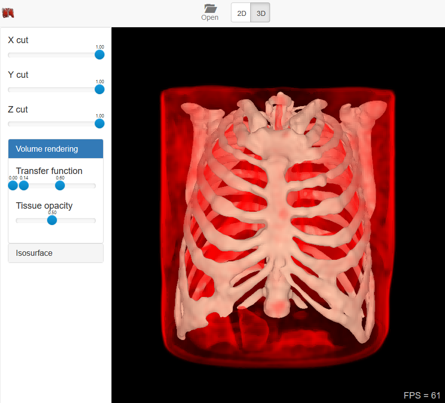
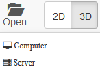
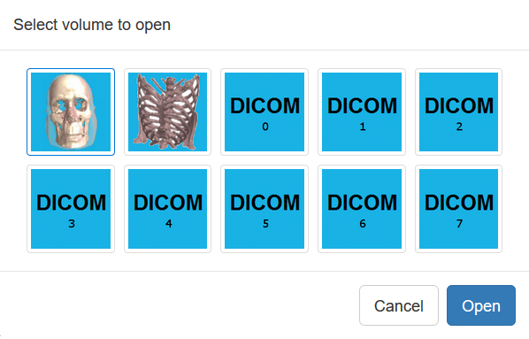

# Med3Web demo application

## Introduction

Med3Web (MRI/CT Web Application) is a first in the world javascript based web-application
for medical (dicom) files viewing and browsing. This application can be used for large
medical centers, for scientific researches and in educational purposes.
Inlike many other competitors, Med3Web allow to view medical volumes in both 2d and 3d mode.

## Requirements

Due to heavy usage of modern 3d graphics, this application need to be run only on computer/mobile device
with very powerfull graphics cards. Below list of hardware, compatible with this application.

Desktop:
  * OS: Windows 10
  * Video card: NVidia GeForce GTX 780 Ti or better
  * CPU: Intel Core i7-2600 or better
  * Memory: 4 Gb or more
  * Browser: Google Chrome is best recommended, but also application can be run in Mozilla Firefox

iPad tablets:
  * OS: iOS 10
  * model: iPad Pro 12
  * Browser: Safari

Android devices:
  * OS: Android 6.0 or later
  * Chipset: Qualcomm MSM8953 Snapdragon 625 or better
  * GPU: Andreno 506 or beter
  * RAM: 3 Gb or more
  * ROM: 32 Gb or more
  * CPU: Cortex-A53 or better
  * Browser: Google Chrome mobile

## Working modes

* [Classic 2d mode](mode_2d.md)
* [Advanced 3d mode](mode_3d.md)

## Quick start

Main GUI on the application start:

You can open medical volumes from: 
  * Your own local disk
  * Preloaded demonstartive volumetric data in our own web locations (just for demonstration purposes)

To open medical volume use 'Open' button:

Here you can select data source:
  * Computer: load files from local folder
  * Server: read volume from preloaded web location

### Important note for loding DICOM files from local folder

It is required to select ALL files in dicom folder, not a single file.

### Read preloading medical volumes

First 2 volumes are in KTX (OpenGL specfic) file format (not a standard Dicom format)
  * Skull model
  * Lungs model
Other 8 volumes are in Dicom format (loading time is significantly slow in a comparison with KTX format).
All of thme are different lungs files

## Know issues

* On some mobile devices application cant be run due to very slow video card or absent of OpenGL features support.
* Compressed images in dicom files are not supported yet
* Some dicom files (with broken or non-stadnard tags) cant be loaded

