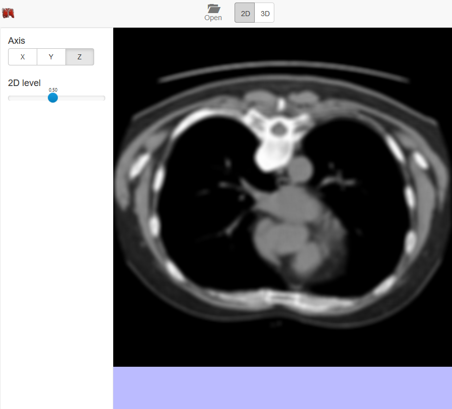

# 2d mode visualization

## 2d mode controls explanation

On the left panel in application you can try different tools for 2d mode viewing/browsing:
  * Axis: used to select axis (one from x, y, z) perpendicular to slices, displayed in the main right panel
  * 2D Level: control slider to select desired slice level