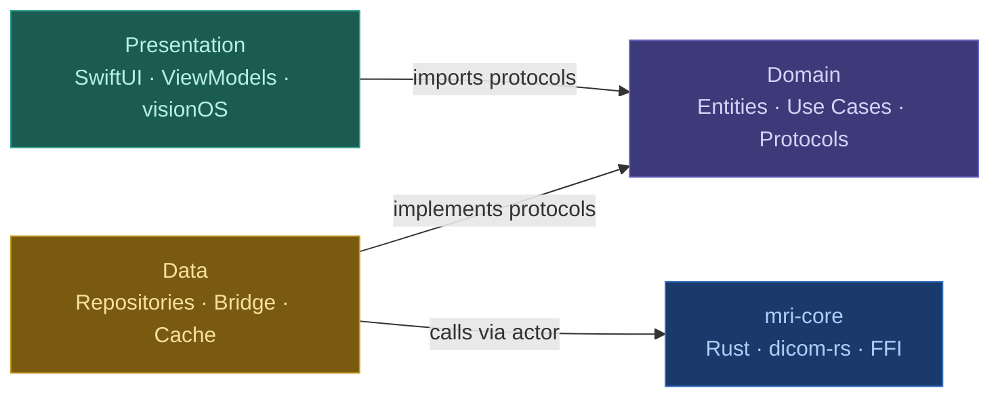
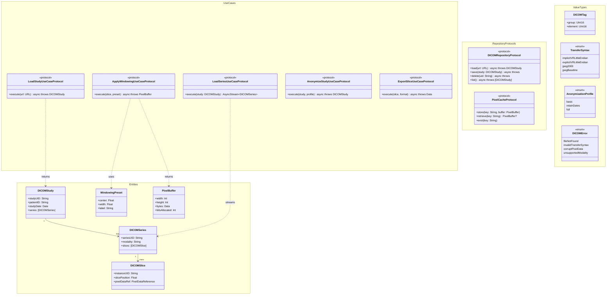
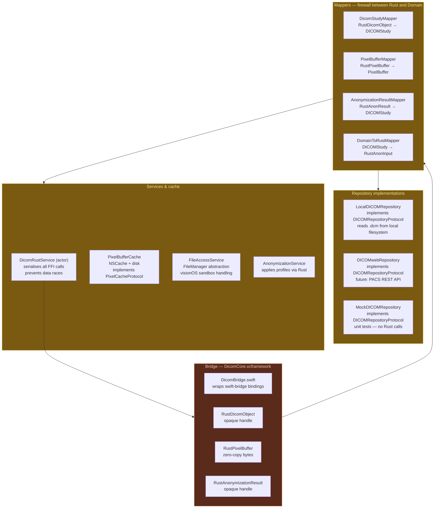
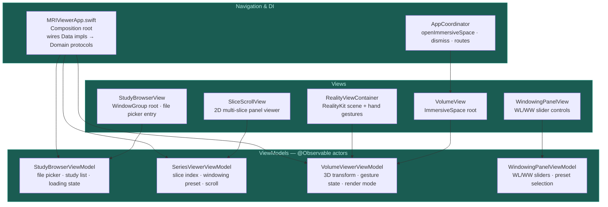
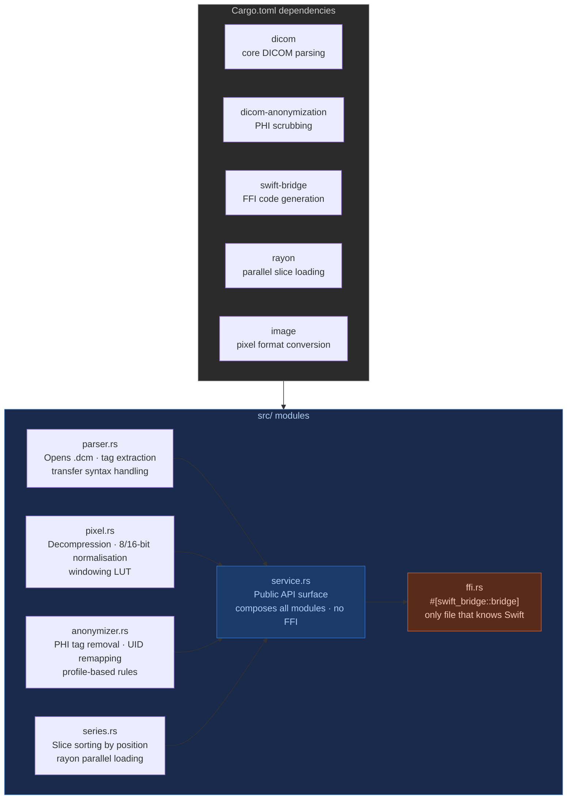
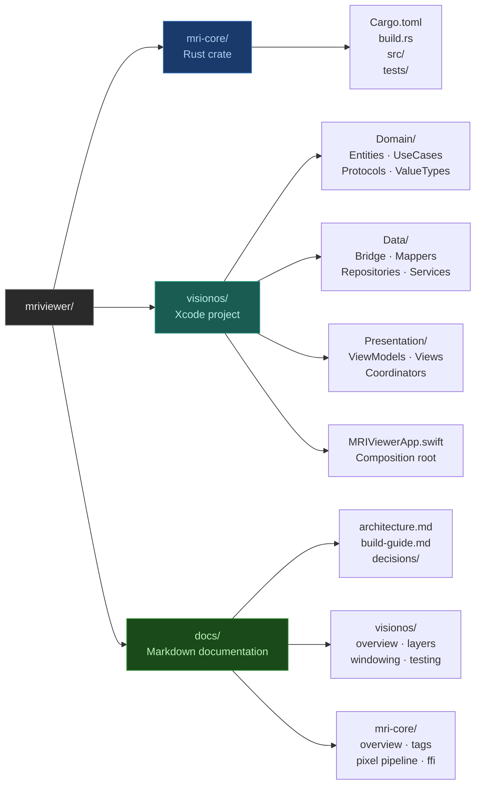

# MRI Viewer — Architecture

## Dependency rule

---

## Layer 1 — Domain

> No imports. Pure Swift structs and protocols. Zero framework dependencies.

---

## Layer 2 — Data

> Implements domain protocols. Rust types confined here — never cross into Domain or Presentation.

---

## Layer 3 — Presentation

> Imports Domain protocols only. Never imports Data, Bridge, or Rust types.

---

## Rust crate — mri-core

> Pure Rust. No Swift, no visionOS. Compiled to DicomCore.xcframework.

---

## Project folder structure

